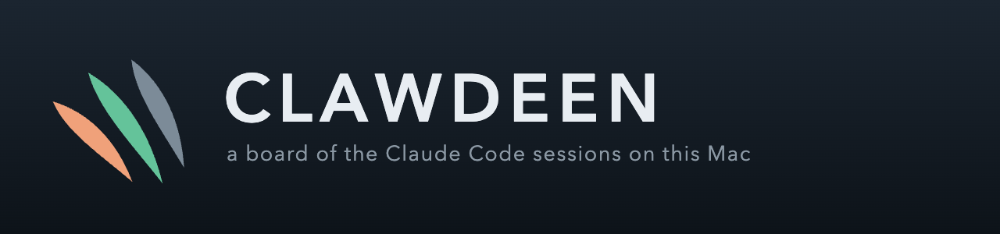
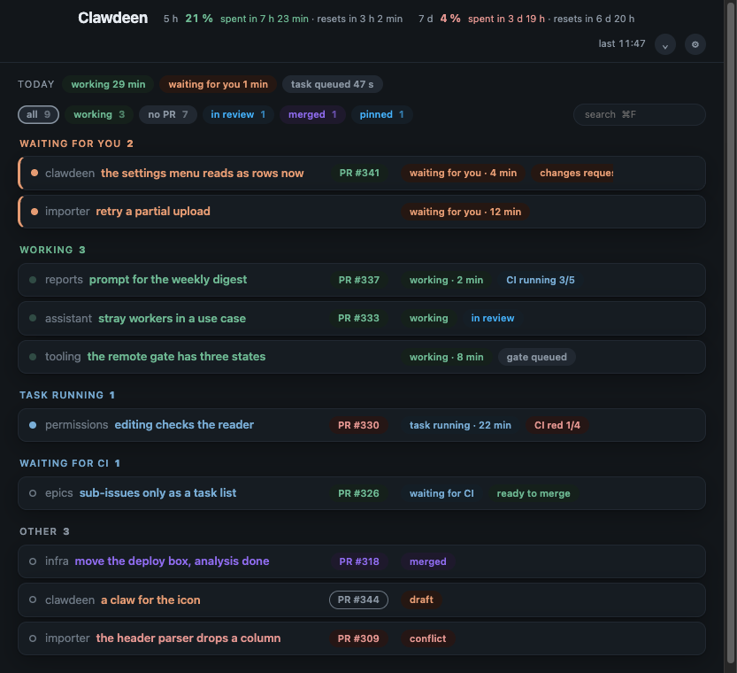

<div align="center">



**What each session is doing, where its pull request stands, and what is left of the usage windows.**

It lives in the menu bar, notifies when a session starts waiting for an answer,
and opens any of them in the Claude app with one click.

[What it reads](#what-it-reads) ·
[The words a row can say](#the-words-a-row-can-say) ·
[Configuration](#configuration) ·
[What you need](#what-you-need) ·
[Running it](#running-it)




</div>

## What it reads

Everything is read locally and nothing about a session leaves the machine. Four calls go out at all:
the ones `gh` and `glab` make for pull requests, one to `api.anthropic.com` for the usage windows,
which sends a token and asks for two percentages, and one to `api.github.com` at start to ask what
the newest release is, which sends nothing but the version already running.

| Source                                                                             | For                                                                                                                                                                                                                                 |
| ---------------------------------------------------------------------------------- | ----------------------------------------------------------------------------------------------------------------------------------------------------------------------------------------------------------------------------------- |
| `~/Library/Application Support/Claude/claude-code-sessions/<account>/<org>/*.json` | the sessions, their titles, working copies, pull requests, and which one is open in the app                                                                                                                                                                        |
| `~/Library/Application Support/Claude/config.json`                                 | which account the sidebar is showing, so the board lists the same one                                                                                                                                                               |
| `~/.claude/projects/*/<cli session>.jsonl`                                         | what the session is doing: a tool still running, a question nobody answered, a turn that ended; and which working copy its own commands name, which is where the repository is read from when the session was opened somewhere else |
| `/tmp/claude-<uid>/*/<cli session>/tasks/*.output`                                 | whether a backgrounded command, monitor or agent is still going                                                                                                                                                                     |
| `gh`, `glab`, `git remote`                                                         | the pull request, its checks, conflicts and review                                                                                                                                                                                  |
| `api.anthropic.com/api/oauth/usage`, with the token Claude Code keeps in the Keychain | the five hour and seven day windows. The token is read, never renewed: renewing it rotates the refresh token and would log the CLI out. An expired one leaves the windows on the last reading, with its age said out loud |

## What it keeps

Its own data lives in the application's `userData` directory, and one field outside it, named below:
`order.json` for the order cards were dragged into, `window.json` for where the window was,
`usage.json` for the last reading of the windows that came back, `settings.json` for the language,
the repositories that are hidden and the order they were dragged into, and the sessions put on
hold, and
`history.db`, a SQLite with one row per stretch of a state. The database is opened with Node's own
`node:sqlite`, which is why this carries no native dependency; Node still calls it experimental and
says so on every start.

The one thing written outside that directory is the name of a session put on hold: the board puts
`ON HOLD - ` in front of the `title` in the session's own record, in the language it is drawing in,
and takes it off again when the session comes back. The record is written back whole, so nothing but
that field moves. The Claude app keeps its titles in memory, so the mark does not reach a running
sidebar: it holds on disk for a session the app is not writing, and shows in the list the next time
the app is started.

## The words a row can say

The board speaks English or Czech, whichever the Mac is in, and the language is a choice in the
settings that outlives the window. The words below are the English ones.

**What the session is doing:** `working`, `gate running`, `gate queued`, `task running`,
`task queued` (a monitor, or a backgrounded command that has written nothing for five minutes),
`waiting for you`, `on hold`. **Where its change stands:** `no PR`, `draft`, `conflict`, `CI running`,
`CI red`, `changes requested`, `ready to merge`, `in review`, `merged`, `closed`. A red CI also
names the job that failed and links to it.

A session waiting on an answer is sorted to the top, its dot turns amber, and the tray counts it.

`on hold` is the one word on this board that is not read off anything: it is set from the row's own
menu, for a session parked on somebody who is not you. A parked row says so instead of saying it
waits on you, drops out of the tray count and into its own lane, and stays exactly where it was
otherwise. It comes off the shelf from the same menu, and on its own the moment the session works
again, because the mark was only ever about the silence. Its name in the Claude app says so too,
under [What it keeps](#what-it-keeps).

Every lane folds away from its own heading, and stays folded until it is opened again. The count
stays on the heading either way, so a lane that is shut still says how much is in it.
While a set of checks is running the word carries how many are done and how long it has been going;
once the run is over it says how long ago it finished.

The gauges say how long each usage window lasts at the pace so far, against the reset it is measured
by: `spent in 1 h 49 min · resets in 4 h 25 min`, both of them in the bar at the top as well as in
the gauges. The numbers and the bar are green while the window outlives its reset, amber within a
tenth of it, red when it runs out first.

What Claude pins is pinned here, marked with an accent down the side of the card. The session open
in the Claude app is ringed in the same colour, read off the record the app stamps when a card is
focused, which says which session is open rather than whether she is looking at it. Cards can be
dragged into any order, which is then hers until the `own order ×` chip gives it back. The
strip under the gauges says what the day went into, summed across every session.

**Which project a card is on** is a stripe down its right edge, in a colour the repository's name
picks out of a fixed palette; the name itself is in the card's tooltip, because a colour says
nothing on its own. The `⚙` menu in the bar swaps that for the name in grey in front of the title,
or turns it off, and remembers the choice.

**Reading the conversation:** the `chat` button on a card opens the transcript beside the board,
read only and with the harness blocks stripped. The tool calls sit behind a fold that names each one
and the one argument saying what it was on; what a tool answered is never carried at all. A sweep of
the board does not reload the pane, so nothing blinks and the reading keeps its place. Escape closes
it.

## Configuration

These files are optional and live outside this repository, because what they point at is not
everyone's. They live in `~/.config/clawdeen/`, and an install made before the board was called
Clawdeen is read from `~/.config/claude-sessions/` where that directory is the one that exists.

`~/.config/clawdeen/gates.json` — where a long local check registers itself. The lock is taken
before the wait for a free slot and the registry only after it, which is how `gate running` and
`gate queued` are told apart.

```json
{ "registry": "${TMPDIR}/clawdeen-gates", "lock": "var/check.lock" }
```

`~/.config/clawdeen/jira.json` — tracker key to base URL, for sessions whose work is not on
GitHub.

```json
{ "ABC": "https://example.atlassian.net/browse/" }
```

`~/.config/clawdeen/private-names.json` — words that must never reach a commit. `npm run check`
refuses a tree carrying one of them, and proves every pattern against its own canary first, because
a regex that stopped matching reads exactly like a repository with nothing to hide. The list is kept
out here rather than in the repository for the obvious reason: a gate that forbids a word has to
spell that word out, and a list committed here would publish what it was built to keep back.
`tools/gate/private-names.example.json` shows the shape. Without the file the check says so plainly
and passes, rather than reading as a clean tree.

```json
[{ "name": "employer", "pattern": "examplecorp", "flags": "i", "canary": "ExampleCorp" }]
```

## What you need

macOS, and Node 22 or newer to build it. The board reads what Claude Code and the Claude desktop
app already write, so there is nothing to set up before the first row appears.

`gh`, signed in, is what fills the pull request column, and `glab` does the same for GitLab. With
neither, a row still says what its session is doing and leaves the change blank, which is the honest
answer rather than a guessed one.

## Live state from the hooks

Reading the transcripts says what a session was doing a moment ago. A hook says it as it happens,
and the board asks for one from its own tray menu, because whoever downloads a build has no checkout
to run a script from. From a checkout:

```bash
npm run hook:install   # adds the hook to ~/.claude/settings.json, keeping what was there beside it
npm run hook:remove    # takes it out again
```

Nothing breaks without it. The hook posts to a loopback port with a token written next to the other
configuration, and reading the files stays the fallback for everything the board does not hear.

## Running it

```bash
npm install
npm run dev          # the window, with reload
npm run icons        # redraws the application and tray icons from the SVG in tools/icons
npm run build:mac    # an ad-hoc signed .app in dist/mac-arm64
npm test             # the reading rules: what a turn is, what is still running, what the checks say
```

The build is signed ad-hoc and not notarised, because notarising asks for a developer account this
project does not have. Ad-hoc is not a formality here: Apple silicon refuses a bundle whose
signature does not check out, and what it tells whoever downloaded it is that the application is
damaged, not that it is unsigned.

### Opening a downloaded build

What a valid signature does not answer is Gatekeeper, which asks for notarisation instead, so a copy
that came through a browser is refused on the first launch. **Right click and Open is not the way
round it any more.** That path is gone on macOS 26, and what is offered instead is `Open Anyway`
under System Settings, Privacy & Security, followed by an administrator password.

The shorter way is to take off the flag the browser set, which is what macOS looks at:

```bash
mv ~/Downloads/Clawdeen.app /Applications/ && xattr -dr com.apple.quarantine /Applications/Clawdeen.app
```

Either is per copy, so the next download asks again. A build made from this checkout never carries
the flag at all and opens on a double click, because nothing downloaded it.

## Keeping it up to date

At start it asks GitHub for the newest release. When there is one, the bar and the tray menu say so,
and one click fetches it, checks it and restarts into it. Asked once per run rather than on a timer:
the board sits in the tray for days and a release is not urgent.

`electron-updater`, which is what an Electron application would normally use, cannot do this here.
Squirrel checks a new bundle against the running one's designated requirement, and an ad-hoc
signature makes that requirement the `cdhash` of one exact build, so no later build can ever satisfy
it. Until there is a Developer ID, the same job is done by hand in `src/main/update.ts`: fetch the
archive for this architecture, unpack it with `ditto`, verify the signature and the bundle
identifier, swap it into place and relaunch. A download that does not verify is never installed, and
the bundle it replaced is renamed beside it and removed at the next start, because a running bundle
cannot delete itself.

It replaces the `.app` it is running out of, so that bundle has to be writable. Where it is not, the
update says so and offers the release page instead.

## What it does not know

The desktop app keeps a pending permission prompt in memory only, so a session held up by one reads
as `working` rather than as waiting. A question asked with `AskUserQuestion` or a plan waiting for
approval is read correctly, because those reach the transcript.

The record format is undocumented and was read off the app; a Claude update can change it.

## Licence

MIT, in `LICENSE`.
